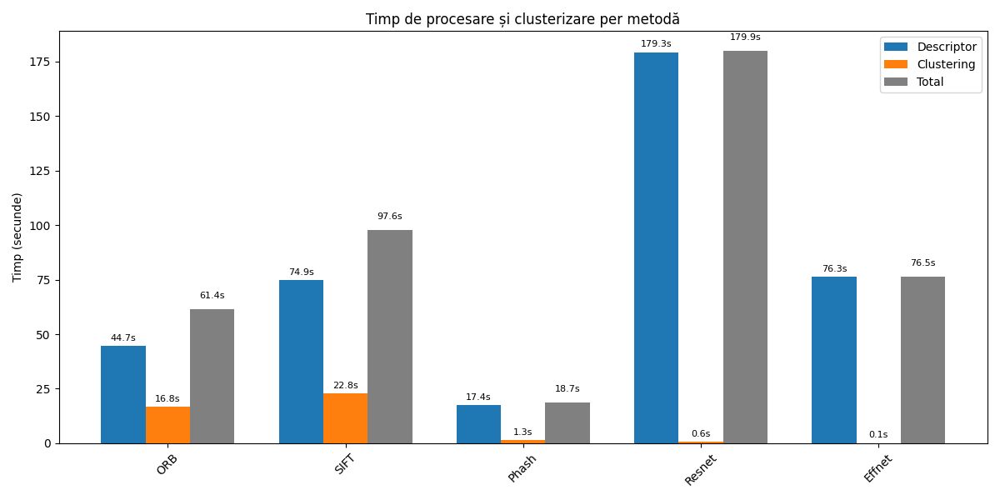

# Logo Similarity
## Program created with the objective to document how different feature descriptors, the Structural Similarity Index Measure and different CNN models behave on clustering a set of logos crawled from the web. Also not using any clustering algorithm like DBSCAN or k-means.

### <u> Feature descriptors</u> used:
- **ORB (Oriented FAST and Rotated Brief)** [ORB - OpenCV docs](https://docs.opencv.org/4.x/d1/d89/tutorial_py_orb.html)  <br/>
- **SIFT (Scale Invariant Feature Transform)**  [SIFT-Wikipedia](https://en.wikipedia.org/wiki/Scale-invariant_feature_transform)<br/>
- **pHASH (Perceptual Hashing)**  [Perceptual Hashing-Wikipedia](https://en.wikipedia.org/wiki/Perceptual_hashing)<br/>
        A perceptual hash is a fingerprint of a multimedia file derived from various features from its content. Unlike cryptographic hash functions which rely on the avalanche effect of small changes in input leading to drastic changes in the output, perceptual hashes are "close" to one another if the features are similar. <br/>
- **pHash and ORB combined** <br/>
        For 2 images to be considered similar they need to have similar ORB scores and also simillar pHash scores. This is a good combination because ORB gets the local details and pHash keeps track of the general aspect of the logo.
###  <u> Structural Similarity Index (SSIM) </u> 
[Structure Similarity Index - SciKit docs](https://scikit-image.org/docs/0.25.x/auto_examples/transform/plot_ssim.html) <br/>
Method that compares 2 pictures at a global level, meaning that it analyses contrast, structure and lightning. It is able to detected small differences in color or contrast. 
### <u> CNN pre-trained models</u> used:
- **ResNet50**
- **EfficientNet B0**
# How to run (after you installed dependencies)
```bash
python3 main.py --orb          # Only ORB
python3 main.py --phash        # Only pHash
python3 main.py --orbphash     # ORB + pHash combo
python3 main.py --ssim         # SSIM (slow comparison process)
python3 main.py --resnet       # ResNet
python3 main.py --effnet       # EfficientNet
python3 main.py --all          # Run everything
```
# Experiments
- First, regarding the Logo crawiling method I've used. I built a web sraper designed to extract and download logo images from a parquet file. 
It uses several powerful libraries: <u> pandas</u> to handle the parquet file, <u> requests</u> to handel HTTP requests, <u>BeautifulSoup</u> for HTML parsing and locating logo-related tags.
For each domain, the script attempts to visit the homepage, identify a likely logo image (typically marked by "logo" in attributes or standard <link rel="icon"> tags), and download it to a specified folder.
The results — including the domain, logo URL, and local file path — are saved into a CSV file for further use. The script also measures and prints the total execution time.
<br/>Results for the given URLS: <br/>
<i>Out of 4384 URLS the algorithm found 2568 logos in 172 minutes. </i> <br>
- Then, regarding each method's performance I've created a chart for 2568 LOGOS computation time. Each method is evaluated based on <u>descriptor computation</u> time, <u>clustering time</u> and <u>total time</u>. <br>
 <br/>
<u> The groups/clusters created can be found in src/logs.txt </u>
- From the results, ResNet is the most time-consuming method in terms of descriptor computation (179s), though clustering is nearly instantaneous. EfficientNet shows similar behavior with a high descriptor time (76s) and negligible clustering time. Traditional methods like ORB and SIFT balance computation and clustering more evenly, with SIFT being the slowest among the two overall. pHash stands out as the most efficient, with the lowest total time (~18s), making it an excellent choice for quick clustering tasks. This comparison helps highlight the trade-offs between deep learning-based and classical approaches in terms of speed and complexity. <br>
- Although methods like ORB, SIFT, pHash, ResNet, and EfficientNet are effective in identifying visual similarities based on mathematical or learned features, they don’t necessarily reflect how humans perceive logo similarity. These techniques focus on structural or statistical patterns, which often miss the subtle nuances that human eyes easily recognize. In contrast, SSIM (Structural Similarity Index) offers a more perceptual approach, comparing images in a way that aligns more closely with human visual judgment. However, this advantage comes at a cost—SSIM is significantly more time-consuming, especially when comparing large datasets, making it less efficient for large-scale clustering despite its superior perceptual accuracy. <br/>
SSIM RESULTS: <br>
For 2568 LOGOS SSIM had a total of 3288330 comparations to make. This took 4:27:14 to compute.
Some groups are written in Experiments/ssim_1000Logos.txt .